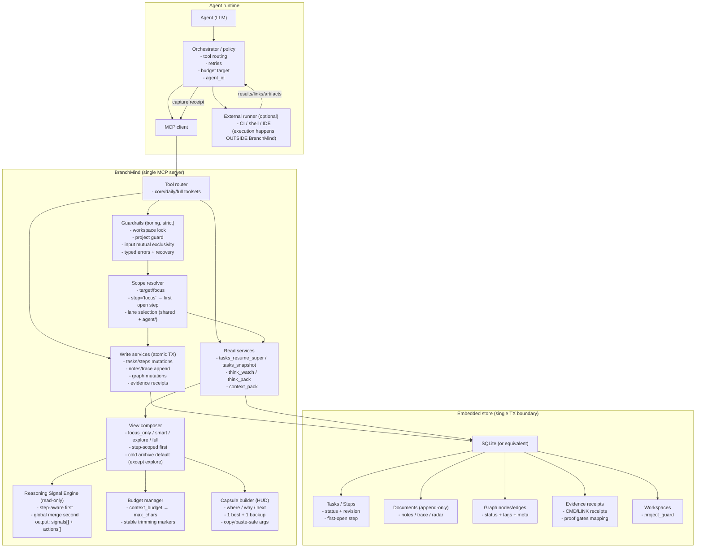

# Memory Model (native-feeling, bounded, multi-agent)

This document describes the “physics” that makes BranchMind feel like native memory for agents,
while staying deterministic, budgeted, and not turning into a dump.

## Design invariants (non-negotiable)

1. **Deterministic:** same input → same output (stable ordering, no wall-clock heuristics).
2. **Read-only analytics:** “smartness” never mutates store state; it only emits `signals` + `actions`.
3. **Step = atom of attention:** step-scoped retrieval is always the default working set.
4. **Cold archive by default:** closed/unpinned/unscoped history is opt-in.
5. **1 best action + 1 backup:** prevent “action sprawl”.
6. **Hard project boundary:** workspace lock + project guard prevent accidental cross-project drift.
7. **Multi-agent isolation:** drafts are lane-scoped; shared anchors are promoted explicitly.

## Coordinates (the address of memory)

BranchMind treats memory as a coordinate system:

- **workspace**: the world / project boundary (hard wall).
- **task focus**: the current mission in the workspace.
- **step focus**: the current “room” (usually the first open step of the focused task).
- **lane**: parallel movement lanes (`shared` + `agent/<id>`).

An agent should never spend tokens figuring out “where am I”.

## Portal invariant: capsule as HUD

Portal-style tools (resume/snapshot/watch) must include a small stable `capsule` that remains useful
under aggressive budgets.

The capsule is the HUD:

- **where**: workspace + target/docs + step focus + lane
- **why**: top signals (bounded; engine-derived)
- **next**: 1 primary + 1 backup action (bounded; copy/paste-safe args)
- **budget**: explicit truncation (top-level `budget` + `degradation` fields)

## Views (smart vs explore vs full)

The same tool can provide different retrieval modes:

- `view="focus_only"`: step focus + minimal supporting context only (hard anti-noise).
- `view="smart"`: step focus + frontier + anchors + *cold* recent padding (open-first).
- `view="explore"`: like smart, but with **warm archive** padding (more history is allowed).
- `view="audit"`: like smart, but with **all lanes visible** (explicit multi-agent sync/debug mode).
- `view="full"`: completeness-first envelope (bounded only by explicit limits/budget).

## Lanes vs branches

Two different mechanisms (do not conflate):

- **lanes** are for *noise isolation* (parallel drafts); implemented as tags/meta inside the canonical branch.
- **branches** are for *alternatives* (“what-if” reasoning); implemented via explicit branching + merge/resolve.

**Publish** promotes a lane-scoped draft into the shared lane to become a durable anchor.

## Step lease (optional “room lock”)

Multi-agent work needs a way to avoid accidental interference on the **same step** (the same “room”).

BranchMind provides an optional **step lease**:

- Lease scope: a **single step** (`step_id`), not a task and not a branch.
- Lease identity: `agent_id` (normalized; stable; explicit).
- Enforcement: when a step has an active lease, **step mutations** require the holder’s `agent_id` (otherwise fail with a typed error + recovery suggestions).
- Deterministic expiry: leases use a logical `expires_seq` (workspace event sequence), not wall-clock time.
- Visibility: portal HUD (`capsule.where.step_focus`) and `step_focus.detail` may surface lease metadata (holder + expiry) for zero-confusion resumption.

## System overview (one diagram)

## Reasoning Signal Engine (pipeline)

The engine is a deterministic analyzer pipeline over `(graph + trace + receipts)`.

```mermaid
flowchart LR
  IN["Inputs (read-only)
  - cards + edges
  - trace entries
  - receipts
  - step focus tag
  - lane filter"] --> NORM["Normalize
  - link refs
  - derive recency
  - scope slice (step-first)"]

  NORM --> A0["Lane hygiene
  lane-scoped decision
  → suggest publish to shared"]
  A0 --> A1["Evidence strength (BM2)
  score evidence by receipts
  + CI > local hints"]
  A1 --> A2["Blind spots
  hypothesis/decision without evidence
  → propose question/test"]
  A2 --> A3["Executable tests (BM5)
  choose best runnable test
  + suggest evidence capture"]
  A3 --> A4["Time decay (BM8)
  stale evidence → recheck"]
  A4 --> A5["Contradictions (BM1)
  supports vs blocks conflicts"]
  A5 --> A6["Confidence propagation (BM3)
  what is actually proven?"]
  A6 --> A7["Assumption surfacing (BM6)
  changed assumptions → recheck dependents"]
  A7 --> A8["Reasoning patterns (BM9)
  criteria matrix / bisect / experiment"]
  A8 --> A9["Counter-argument (BM7)
  steelman + disconfirming test"]
  A9 --> A10["Meta hooks (BM10)
  stuck / scope creep / no new evidence"]

  A10 --> OUT["Output
  - ranked signals[]
  - ranked actions[]
  policy: 1 best + 1 backup"]
```

## Implementation plan (flagship, minimal, reversible)

1. **Contracts first:** define capsule/HUD invariants, view semantics (`explore`), lane filtering rules.
2. **Scope first:** make `step="focus"` + lane selection deterministic across all portals.
3. **Views:** implement `explore` as “smart + warm archive”, keep `focus_only` strict.
4. **Capsule everywhere:** add a capsule to every portal output (resume/snapshot/watch), keep it budget-resilient.
5. **Consistency sweep:** propagate `agent_id` + `context_budget` to all relevant read tools; unify defaults.
6. **Guards + tests:** lock down regressions with contract tests + portal smoke tests.
